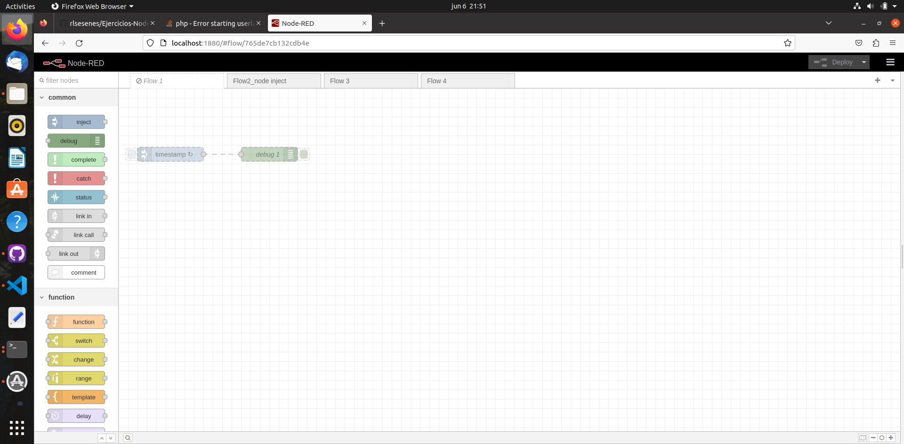
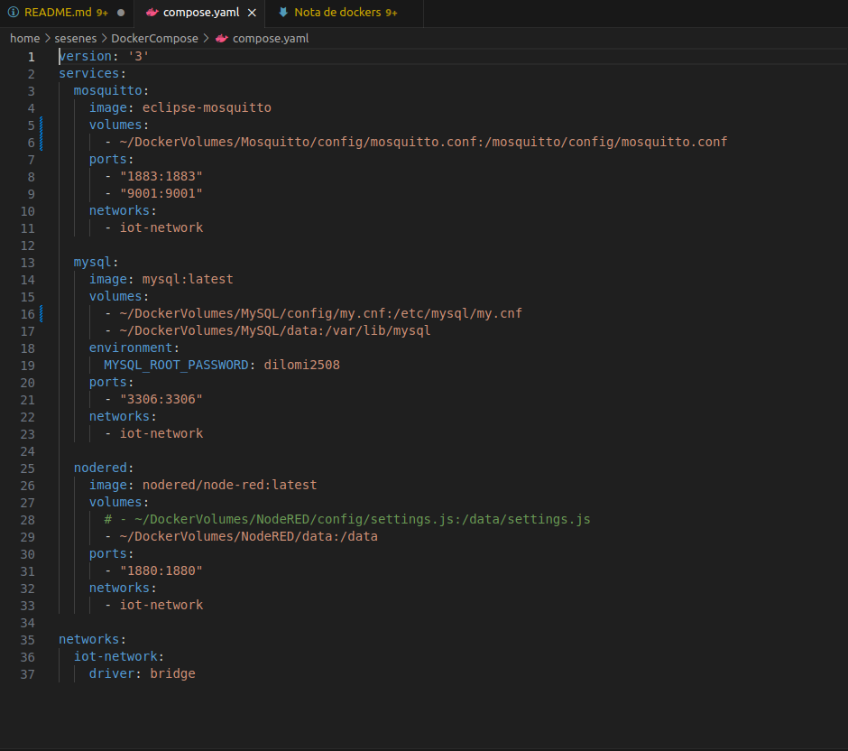

# Ejercicios-Node-Red-2023
Se anexa el nuevo repositorio de los ejercicios 2023
prueba de cambios en gitdesktop

# DOCKER 

Esta es la primera documentación para el uso de docker empleando markdown, en este primer documento se describen los pasos para arrancar node red con docker_compose.

1. Es necesario desplegar los archivos contenidos en Home con el comando ls

2. Posteriormente introducir el comando cd DockerCompose

3. Una vez en el directorio correcto  correcta hacer
   

        docker ps -a 
        docker compose up -d 

4. En caso de que el contenedor no corra con **docker compose up -d** debido a puertos en uso ocupar el siguiente commando indicando el puerto en conflicto 

        sudo kill `sudo lsof -t -i:3306`

Con esto docker debe empezar a correr y de ahi nos vamos al localhost:1880 para ver Node-Red

Realizar el siguiente ejercicio 

1. Verificar que el archivo .yaml contenga en la parte de node red trabajando en  - ~/DockerVolumes/NodeRED/data:/data

2. Se deben descomentar las lineas 27 y 29  del archivo .yaml, las cuales corresponden al contenedor Node-Red,  el archivo debe quedar como se muestra en la siguiente Figura

3. Con el siguiente comando observarmos los id de contenedor

        docker ps -a

4. Posteriormente detenemos el contenedor con: 

         docker compose stop [id del contendor]

5. Borrar el contenedor que se modifico con:
   
        docker rm [id contendor]

6. Se procede a borrar la imagen del contenedor modificado en el archivo .yaml para lo cual primero se deben de llamar las imagenes generadas con el comando: 

        docker images 
7. Posteriormente se borra la imagen con : 

        docker rmi[id de la imagen]
    
8. Una ves realizado esto apagamos compose con:

        docker compose down 

9. Se procede a reiniciar compose con la siguiente instrucción: 

         sudo systemctl restart docker
10. Se arranca compose nuevamente con:

        docker compose up -d 

**Nota**: Se verifica nuevamente corriendo el comando en el paso 3. 
